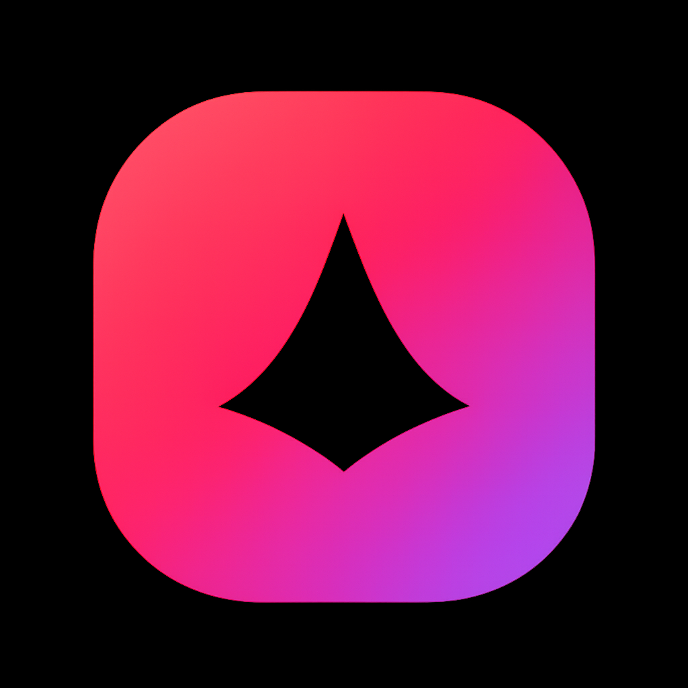

<div align="center">
  

  <h1>NatsumeWatch — Mobile</h1>

  <p>Нативное Android-приложение для просмотра аниме на базе бэкенда <a href="https://github.com/kaisenlihs-ux/natsumewatch">NatsumeWatch</a>.</p>

  <p>
    <a href="https://github.com/natsumestun/natsumewatch-mobile/releases/latest"></a>
    
    
    
    
  </p>
</div>

---

## Возможности

- **Каталог и поиск** — фильтры по жанру, типу, году, сезону, статусу, рейтингу; пагинация с infinite scroll.
- **Главная** — hero-карусель онгоингов и тематические ряды (свежие, в эфире, прошлый сезон).
- **Страница тайтла** — постер, три названия (RU / EN / JP), внешние рейтинги, мета (студия, режиссёр, источник), описание, жанры, эпизоды и переключатель озвучек.
- **Плеер** — нативный HLS-плеер AniLibria через `expo-video` (fullscreen, PiP, ландшафт) и Kodik в WebView.
- **Авторизация** — email/пароль и OAuth через Google / Discord (если включены на бэкенде); JWT в `expo-secure-store`.
- **Списки и профиль** — Запланировано / Смотрю / Просмотрено / Отложено / Брошено / Избранное; загрузка и удаление аватара и баннера.
- **Соцфункции** — комментарии (треды, лайки, ответы), рецензии (с оценкой 1–10), друзья (поиск, заявки, входящие/исходящие), 1-на-1 сообщения.
- **История просмотра** — подробный список с возможностью продолжить с того же эпизода и озвучки.
- **Статистика** — карточки общих чисел и диаграммы по жанрам, типам, годам (на чистом `react-native-svg`).
- **Торренты** — список AniLibria-раздач, открытие magnet через `Linking.openURL` (qBittorrent / Flud / LibreTorrent), копирование magnet, скачивание `.torrent`.
- **Тёмная тема** — те же цвета и шрифт Rubik, что и на сайте.

## Установка APK

1. Откройте на Android-устройстве страницу [последнего релиза](https://github.com/natsumestun/natsumewatch-mobile/releases/latest) и скачайте `natsumewatch.apk`.
2. Если Android попросит — разрешите установку из неизвестных источников для браузера / файлового менеджера.
3. Откройте APK и нажмите «Установить».

**Минимум:** Android 7.0 (API 24). **Цель сборки:** Android 16 (API 36). Поддерживается ~98% активных Android-устройств.

## Стек

- **Платформа:** [Expo SDK 54](https://docs.expo.dev/) + [React Native 0.81](https://reactnative.dev/), [TypeScript](https://www.typescriptlang.org/) (strict).
- **Навигация:** [`@react-navigation/native-stack`](https://reactnavigation.org/) + bottom tabs.
- **Сеть и кэш:** [TanStack Query](https://tanstack.com/query/latest).
- **Состояние клиента:** [Zustand](https://github.com/pmndrs/zustand).
- **Хранилище:** [`expo-secure-store`](https://docs.expo.dev/versions/latest/sdk/securestore/) (JWT).
- **Медиа:** [`expo-video`](https://docs.expo.dev/versions/latest/sdk/video/) (HLS) + [`react-native-webview`](https://github.com/react-native-webview/react-native-webview) (Kodik).
- **OAuth:** [`expo-web-browser`](https://docs.expo.dev/versions/latest/sdk/webbrowser/) + [`expo-linking`](https://docs.expo.dev/versions/latest/sdk/linking/).
- **Графика:** [`react-native-svg`](https://github.com/software-mansion/react-native-svg) (диаграммы).
- **Сборка:** [EAS Build](https://docs.expo.dev/build/introduction/).

## Локальная разработка

```bash
git clone https://github.com/natsumestun/natsumewatch-mobile.git
cd natsumewatch-mobile
npm install
npx expo start
```

Сканируйте QR-код приложением **Expo Go** на Android. Для нативного HLS-плеера и Kodik-WebView нужен dev client:

```bash
npx expo run:android   # требует Android SDK и подключённое устройство/эмулятор
```

Проверка типов и конфигурации:

```bash
npx tsc --noEmit
npx expo-doctor
```

## Сборка APK / AAB через EAS

Бесплатный план EAS требует только аккаунт на [expo.dev](https://expo.dev).

```bash
npm install -g eas-cli
eas login
eas build -p android --profile preview      # APK для установки напрямую
eas build -p android --profile production   # AAB для Google Play
eas build -p ios --profile preview          # iOS simulator build
```

Профили описаны в [`eas.json`](./eas.json). Логи и статус — на странице проекта в Expo: `https://expo.dev/accounts/<owner>/projects/natsumewatch/builds`.

OTA-обновления без новой APK:

```bash
npx expo install expo-updates
eas update:configure
eas update --branch preview --message "Описание изменений"
```

## Конфигурация

API-адрес зашит в [`app.json`](./app.json) → `expo.extra.apiBaseUrl`. По умолчанию — публичный Fly-инстанс бэкенда:

```
https://natsumewatch-backend-wsjmfcnv.fly.dev
```

Чтобы переключиться на локальный/staging-бэкенд, измените значение и пересоберите.

## Структура проекта

```
.
├── App.tsx                  # QueryClient, Auth provider, Navigation root
├── app.json                 # Expo config (name, icons, plugins, package)
├── eas.json                 # EAS build profiles (preview / production)
├── assets/                  # icon, adaptive-icon, splash-icon, favicon
└── src/
    ├── api/                 # client.ts (fetch + JWT), types.ts, posters.ts
    ├── components/          # Hero, PosterCard, PosterRow, RatingsBar,
    │                        # DubSwitcher, EpisodeGrid, ListPicker, Pill, Loading
    ├── navigation/          # RootNavigator (stack) + TabNavigator
    ├── screens/             # Home, Catalog, Random, Anime, Player, KodikPlayer,
    │                        # Login, Register, Profile, MyList,
    │                        # History, Stats, Friends, Chat,
    │                        # Comments, Reviews, Torrents
    ├── store/               # Zustand auth store
    ├── theme/               # Colors / radii / spacing
    └── utils/               # format helpers
```

## Roadmap

- [x] Каталог, поиск, фильтры, hero и тематические ряды
- [x] Страница тайтла, эпизоды, переключатель озвучек
- [x] Нативный HLS-плеер + Kodik WebView
- [x] Авторизация, JWT, списки, профиль
- [x] Загрузка аватара и баннера
- [x] Комментарии (треды, лайки, ответы)
- [x] Рецензии с оценкой
- [x] Друзья и 1-на-1 сообщения
- [x] История просмотра + продолжение с эпизода
- [x] Статистика с диаграммами
- [x] Торренты + magnet через Intent
- [x] OAuth (Google / Discord)
- [x] iOS-конфигурация в `eas.json`
- [ ] WebSocket вместо polling для сообщений
- [ ] Push-уведомления
- [ ] Загрузка серий для офлайн-просмотра

## Связанные репозитории

- Веб-фронтенд и бэкенд: [kaisenlihs-ux/natsumewatch](https://github.com/kaisenlihs-ux/natsumewatch)
- Сайт: [natsumewatch.devinapps.com](https://out-gxdonjlx.devinapps.com/)
